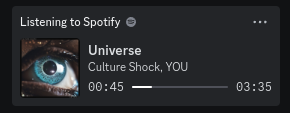

# Poweramp Rich Presence for Discord Mobile

This app was created, because I wanted to move away from Spotify and use Poweramp as my main music player. However Poweramp has no Discord Rich Presence support and Spotify has a special integration with Discord. Normally rich presence is limited to setting title and status, but with Spotify you can set album art, song name, artist name and more. Also, regular rich presence support is (AFAIK) PC only.

While moving away, I didn't want to lose this cool widget on my profile:

  

So I tracked down the way Spotify reports track updates to Discord and figured that they use regular Android broadcast intents. It's more or less [documented](https://developer.spotify.com/documentation/android/tutorials/android-media-notifications) even! 😊

Unfortunately they all seem to be prefixed with Spotify's package name, so I thought I won't be able to send them from my own app, but apparently that's not the case. If I send the same intents with the same extras, Discord will pick them up and display them as if they were from Spotify.

This app does exactly that. It listens for track changes in Poweramp and sends the same intents to Discord. It also listens for Poweramp's play/pause events and sends the appropriate intents to Discord and all other apps that listen for them.

## How does it resolve Spotify titles from Poweramp metadata?

I get some details such as song title and artist from Poweramp's intents. I then use the [Spotify API](https://developer.spotify.com/documentation/web-api/reference/tracks/get-track/) using a cached anonymous token to get the Spotify ID of the track. These IDs are then cached locally (for up to 500 entries). When I send the intents to Discord, I include the Spotify ID in the extras. Discord then resolves the ID to the actual track details and displays them.

## Limitations

- This app only works with Poweramp. It's not a general solution for any music player. It's really easy to modify the source for other players, but I only really needed Poweramp support.
- This app only works on Android and was tested with the old, Java based Discord app. I don't know if it works with the new, React Native based app.
- Some track change events are sent duplicated as Poweramp sends track state changes as well as metadata changes sometimes and sometimes not. I did not yet implement a Queue listener to filter out duplicates, but for now all events are sent, just sometimes twice. This is obviously more data than necessary, but it's not a big deal.
- When you seek in a track, Poweramp emits no event, so Discord will not update the progress bar. This is a limitation of Poweramp and I can't do anything about it.

## Installation

1. Pair your Spotify account with Discord
2. Download the latest release from the [releases page](https://github.com/Diniboy1123/PowerampRichPresence/releases)
3. Install the APK
4. You must open the app at least once, so intents get picked up ([docs](https://developer.android.com/about/versions/android-3.1.html#launchcontrols)). Don't be surprised about the empty screen, it's just a placeholder. You can close the app afterwards.
5. Start some music in Poweramp

The app should now send track updates to Discord.

That's it! Enjoy your new rich presence! 🎉